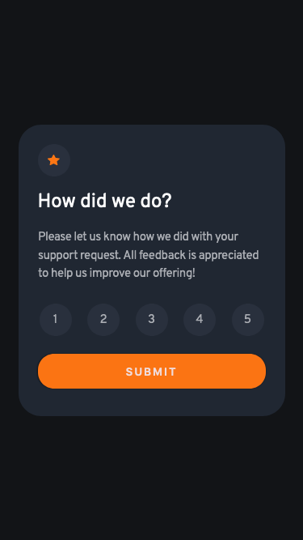
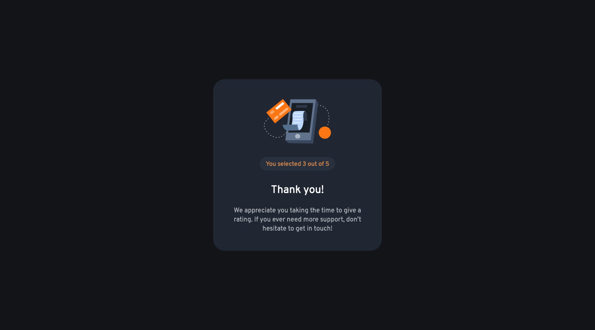

# Frontend Mentor - Interactive rating component solution

This is a solution to the [Interactive rating component challenge on Frontend Mentor](https://www.frontendmentor.io/challenges/interactive-rating-component-koxpeBUmI). Frontend Mentor challenges help you improve your coding skills by building realistic projects.

## Table of contents

- [Overview](#overview)
  - [The challenge](#the-challenge)
  - [Screenshot](#screenshot)
  - [Links](#links)
- [My process](#my-process)
  - [Built with](#built-with)
  - [What I learned](#what-i-learned)
  - [Continued development](#continued-development)
  - [Useful resources](#useful-resources)

## Overview

### The challenge

Users should be able to:

- View the optimal layout for the app depending on their device's screen size
- See hover states for all interactive elements on the page
- Select and submit a number rating
- See the "Thank you" card state after submitting a rating

### Screenshots

Add a screenshot of your solution. The easiest way to do this is to use Firefox to view your project, right-click the page and select "Take a Screenshot". You can choose either a full-height screenshot or a cropped one based on how long the page is. If it's very long, it might be best to crop it.

### Links

- Solution URL: [github repo](https://github.com/owi92/interactive-rating-comp)
- Live Site URL: [GHpages](https://owi92.github.io/interactive-rating-comp/)

## My process

### Built with

- Angular + basic HTML/CSS/JS

### What I learned / Continued development

This was my first Angular "project".
In hindsight there were things I would do differently. For example, I don't think the rating part needed to be it's own component. The structure overall is a little messy. Also I should have used global styles more instead of repeating some styles in different components. I did not use BEM or CUBE for naming the selector classes, even though I think they help with more readable code.

I also wanted to focus on accessibility, which is a large and import topic I still struggle with. I looked at multiple guides and resources, but I still don't feel that I really understand or know which steps to take to make a website accessible for as many people as possible.

### Useful resources

- [W3 Introduction to Accessibility](https://www.w3.org/WAI/fundamentals/accessibility-intro/) - This kind of helped me in getting an overview regarding accessibility, but it's also a little overwhelming to get started with.
